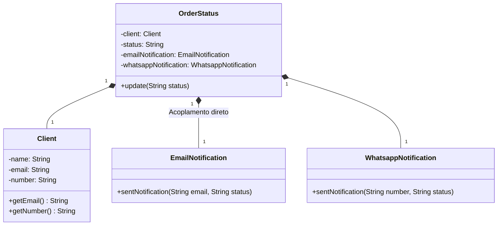

# Observer Anti Pattern

```mermaid
classDiagram
%% Diagrama do Anti-Pattern (Acoplamento Forte)
class OrderStatus {
-client: Client
-status: String
-emailNotification: EmailNotification
-whatsappNotification: WhatsappNotification
+update(String status)
}

    class Client {
        -name: String
        -email: String
        -number: String
        +getEmail() String
        +getNumber() String
    }

    class EmailNotification {
        +sentNotification(String email, String status)
    }

    class WhatsappNotification {
        +sentNotification(String number, String status)
    }

%% Relacionamentos Problemáticos
OrderStatus "1" *-- "1" Client
OrderStatus "1" *-- "1" EmailNotification : Acoplamento direto
OrderStatus "1" *-- "1" WhatsappNotification
```