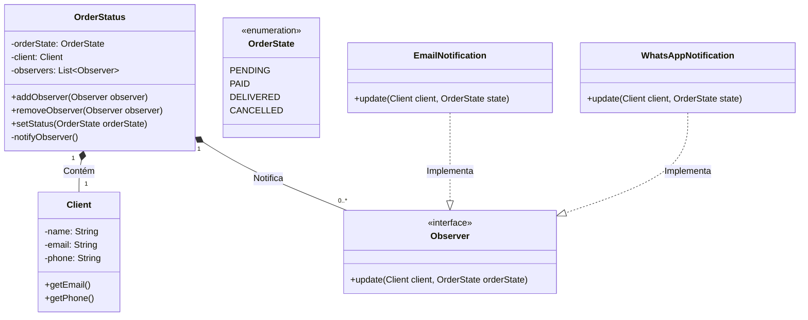

```mermaid
classDiagram
    class OrderStatus {
        -orderState: OrderState
        -client: Client
        -observers: List~Observer~
        +addObserver(Observer observer)
        +removeObserver(Observer observer)
        +setStatus(OrderState orderState)
        -notifyObserver()
    }

    class Client {
        -name: String
        -email: String
        -phone: String
        +getEmail()
        +getPhone()
    }

    class OrderState{
        <<enumeration>>
        PENDING
        PAID
        DELIVERED
        CANCELLED
    }

    class Observer{
        <<interface>>
        +update(Client client, OrderState orderState)
    }

    class EmailNotification {
        +update(Client client, OrderState state)
    }

    class WhatsAppNotification {
        +update(Client client, OrderState state)
    }


%% RELACIONAMENTOS CORRETOS:
    OrderStatus "1" *-- "1" Client: Contém
    OrderStatus "1" *-- "0..*" Observer: Notifica
    EmailNotification ..|> Observer: Implementa
    WhatsAppNotification ..|> Observer: Implementa
```