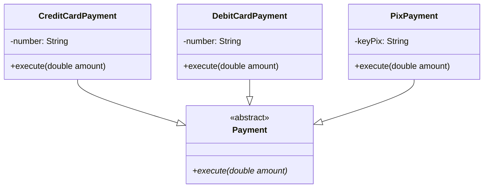

# Strategy Anti Pattern

```mermaid
classDiagram
    class Payment {
        <<abstract>>
        +execute(double amount)*
    }

    class CreditCardPayment {
        -number: String
        +execute(double amount)
    }

    class DebitCardPayment {
        -number: String
        +execute(double amount)
    }

    class PixPayment {
        -keyPix: String
        +execute(double amount)
    }

    CreditCardPayment --|> Payment 
    DebitCardPayment --|> Payment 
    PixPayment --|> Payment 

```