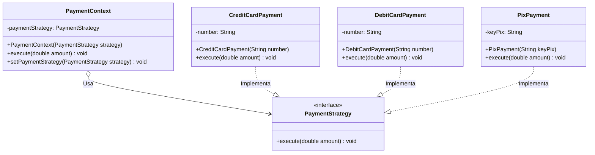

# Strategy Pattern

```mermaid
classDiagram
    class PaymentStrategy {
        <<interface>>
        +execute(double amount) void
    }

    class CreditCardPayment {
        -number: String
        +CreditCardPayment(String number)
        +execute(double amount) void
    }

    class DebitCardPayment {
        -number: String
        +DebitCardPayment(String number)
        +execute(double amount) void
    }

    class PixPayment {
        -keyPix: String
        +PixPayment(String keyPix)
        +execute(double amount) void
    }

    class PaymentContext {
        -paymentStrategy: PaymentStrategy
        +PaymentContext(PaymentStrategy strategy)
        +execute(double amount) void
        +setPaymentStrategy(PaymentStrategy strategy) void
    }

    PaymentContext o--> PaymentStrategy : Usa
    CreditCardPayment ..|> PaymentStrategy : Implementa
    DebitCardPayment ..|> PaymentStrategy : Implementa
    PixPayment ..|> PaymentStrategy : Implementa
```
